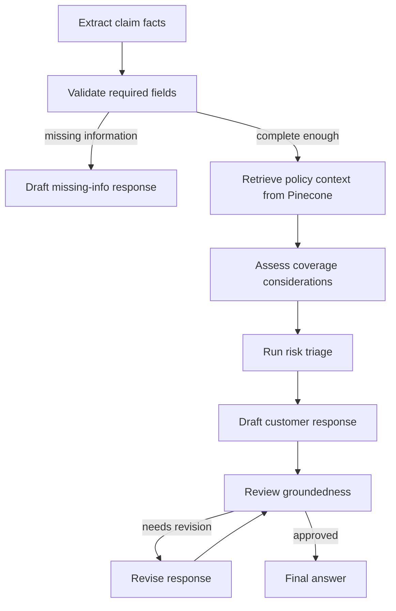

# ClaimAssist Graph

ClaimAssist Graph is a backend-first insurance claim assistant built with LangGraph and retrieval-augmented generation (RAG). It helps claim operations teams turn a customer claim message into a structured claim summary, retrieve relevant policy and procedure guidance from Pinecone, assess likely coverage considerations, flag operational risks, and draft a customer-ready response.

This is designed as a professional starter project: small enough to understand, but organized like a real service rather than a notebook or tutorial.

## Business Goal

Insurance claim teams need consistent, traceable first-pass assistance when customers submit claim details. ClaimAssist Graph supports:

- Faster claim intake by extracting structured facts from unstructured messages.
- More consistent claim handling by grounding responses in policy and procedure documents.
- Better auditability through citations, risk signals, and workflow state.
- Lower operational load by identifying missing claim information before escalation.

The assistant is decision-support software. It does not approve, deny, or settle claims by itself.

## Technical Goal

The main technical focus is a LangGraph workflow powered by RAG:

- LangGraph coordinates the claim assistant as a stateful graph.
- Pinecone stores policy and claim procedure document embeddings.
- OpenAI models extract claim details, assess coverage context, and draft responses.
- FastAPI exposes the graph as a backend service.
- A CLI supports local testing and batch-style usage.

## Tools Used

- Python 3.11+
- LangGraph for stateful agent orchestration
- LangChain Core and LangChain OpenAI for model and embedding integrations
- Pinecone for vector storage and semantic retrieval
- FastAPI and Uvicorn for the HTTP API
- Pydantic Settings for environment-based configuration
- Pytest for tests

## Project Structure

```text
claim-assist-graph/
├── data/
│   └── knowledge_base/          # Seed policy/procedure documents for Pinecone
├── docs/                        # Architecture, RAG, API, and operations docs
├── scripts/
│   └── ingest_documents.py      # Loads local docs into Pinecone
├── src/
│   └── claim_assistant/
│       ├── api.py               # FastAPI app
│       ├── cli.py               # Command line interface
│       ├── config.py            # Runtime settings
│       ├── graph.py             # LangGraph assembly
│       ├── nodes.py             # Graph node implementations
│       ├── prompts.py           # Prompt templates
│       ├── rag.py               # Pinecone retriever and ingestion helpers
│       ├── risk.py              # Deterministic risk triage
│       └── schemas.py           # Shared domain and graph schemas
├── tests/
│   └── test_graph_routing.py
├── .env.example
├── .gitignore
└── pyproject.toml
```

## Setup

1. Create a virtual environment.

```bash
python -m venv .venv
.venv\Scripts\activate
```

2. Install dependencies.

```bash
pip install -e ".[dev]"
```

3. Configure environment variables.

```bash
copy .env.example .env
```

Edit `.env` with your OpenAI and Pinecone credentials.

## Pinecone Index

The default embedding model is `text-embedding-3-small`, which produces 1536-dimensional vectors. Your Pinecone index must use:

- Dimension: `1536`
- Metric: `cosine`

The ingestion script can create the index if your Pinecone account and API key allow index creation.

## Ingest Knowledge Base Documents

```bash
python scripts/ingest_documents.py --source data/knowledge_base
```

The script chunks Markdown documents, embeds them, and upserts vectors into Pinecone with metadata for citations.

## Run The API

```bash
uvicorn claim_assistant.api:create_app --factory --reload
```

Example request:

```bash
curl -X POST http://127.0.0.1:8000/v1/claims/assist ^
  -H "Content-Type: application/json" ^
  -d "{\"message\":\"My basement flooded yesterday after a pipe burst. Policy H-12345. Estimated damage is about $8,500.\"}"
```

## Run The CLI

```bash
claim-assist "My parked car was hit last night. Policy A-7781. Repair estimate is $3,200."
```

## Workflow



## Notes For Production Use

- Add authentication and request-level authorization before exposing the API outside a trusted network.
- Keep human adjusters in the loop for coverage decisions and settlement actions.
- Log graph events to your observability stack, but avoid storing sensitive customer data unnecessarily.
- Add document lifecycle controls so policy versions in Pinecone match the active insurance product.

## Documentation

- [Architecture](docs/architecture.md)
- [RAG Design](docs/rag.md)
- [API](docs/api.md)
- [Operations](docs/operations.md)
- [Security](docs/security.md)
